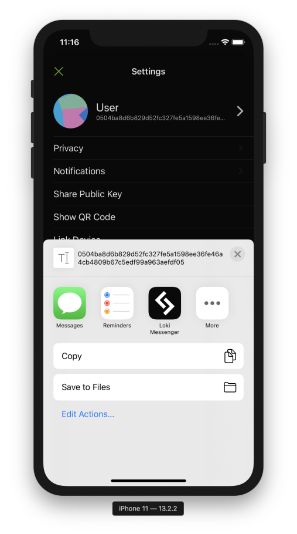
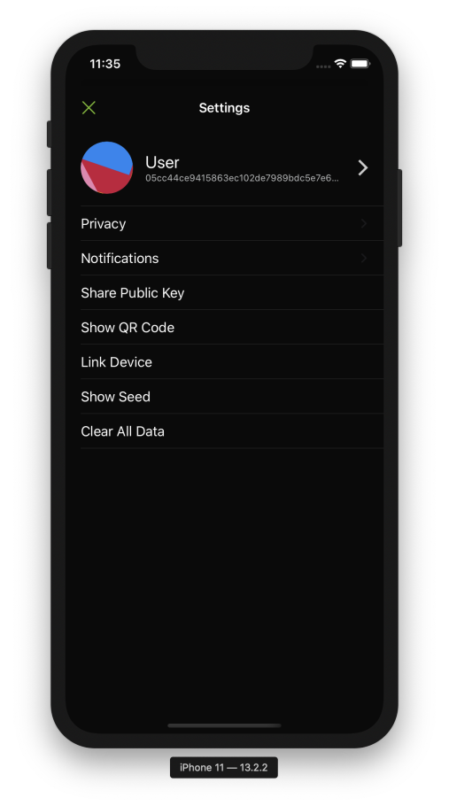

title: Sispop Docs | Multi-Device Support for Session | Decentralised Messenger
description: Session now features cross-platform multidevice support, allowing you to use the same private key across your devices while maintaining security and privacy.

# Session multi-device setup

Session now features cross-platform multidevice support, allowing you to use the same private key across your devices while maintaining security and privacy. Multidevice support is currently in early alpha, and the setup process is less streamlined than it will be when the feature moves out of alpha. The steps outlined in this guide will help you avoid data loss or other adverse effects when setting up multidevice for your Session.

## Primary and secondary device
Currently Session only supports two devices per account: a primary and secondary device. This is only a temporary limitation; in future more than two devices will be able to be connected to the same account. To get started with multi-device, you'll need to start by deciding which device you want to be your primary device, and which will be your secondary.

## Requirements:
- Primary Device: A device with Session downloaded, installed and set up.
- Primary Public Key: The public key from your primary device generated by the Session.
- Secondary Device: A device with the Session installed but not initialised to a key.

## Preparation

If you have Session installed on both devices and they both have their own public keys already, you'll need to delete one public key (effectively deleting one of your Session accounts). This device will become your secondary device.

### Mobile as secondary device

If you want your mobile (i.e. smartphone or tablet) to be your secondary device and your mobile copy of Session already has its own public key, delete the Session application and redownload it from the Apple App Store or Google Play Store.

### Desktop as secondary device
If you want your desktop (or laptop) messenger as your secondary device and it already has its own public key, open Session on your desktop or laptop and go to `File` > `Preferences` > `Clear Data`.

## Setup

For this demonstration we are going to have our mobile device as our primary device and a desktop as our secondary.

### Step 1: Get public address from primary device

On your mobile messenger, go into settings by tapping on your profile icon and copy your public key.

You will need to send this public key to the device that will be your secondary device.

### Step 2: Paste public key into secondary device

> WARNING: Do NOT skip past this step. If you click the `Link` button on your secondary device before the primary device is ready and waiting you may lose the chance to sync the devices.

Your desktop copy of Session should not yet have a public key attached to it. If you already have an account set up on your desktop messenger, jump back to [Desktop as a secondary device](#desktop-as-secondary-device) and clear your data.

Upon opening the Session desktop client, you will be prompted with 3 options:

- Register a new account

- Restore using seed

- Link device to an existing account

Click `Link device to an existing account` and paste your public key copied in [step 1](#step-1-get-public-address-from-primary-device).

> Do not click the **LINK** button yet. We need to prepare our primary device first.

### Step 3: Prepare primary device

To prepare the primary device, we need to go back into the Settings menu and click the `Link Device` button.

Once the button has been clicked, Session on your primary device will show a new popup saying "Waiting for Device".

### Step 4: Click `Link` button on secondary device

Now you can click the `Link` button on your desktop copy of Session.

### Step 5: Authorise connection on your primary device

Once you've clicked `Link` on your secondary device, you will be prompted to authorise the link request on your primary device. Check that the 3 words match between devices, and authorise the request.

## Congratulations!
### You've successfully set up a multi-device account on Session.
