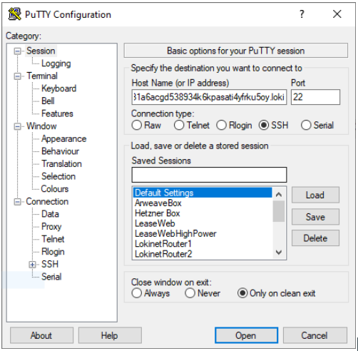

# How to set up free, anonymous reverse SSH 

Have you ever wanted to be able to access a computer behind a firewall or NAT, but didn't want to pay for (or set up) a complicated reverse SSH proxy? Have you ever wanted to set up your VPS or virtual machine so that you can access it anonymously via SSH?  

Sispopnet lets you accomplish both these goals simultaneously. This guide will walk you through the process.

## Step 1 - Install Sispopnet on the computer you want to SSH into (the ‘host’)

>> Note: This guide currently covers Linux operating systems, but we will add macOS instructions soon. 

Install `curl` if you don’t have it already (this will let us download and verify Sispopnet):

```
sudo apt install curl
```

Add the Sispopnet debian repo GPG Keys:

```
curl -s https://deb.sispop.site/public.gpg | sudo apt-key add -
```

Confirm which release you need to download:

```
echo "deb https://deb.sispop.site $(lsb_release -sc) main" | sudo tee /etc/apt/sources.list.d/sispop.site.list
```

Resync your package repositories:

```
sudo apt update
```

Install Sispopnet:

```
sudo apt install sispopnet
```

Make your .sispop address static:

```
sudo nano /etc/sispop/sispopnet.ini
```

Scroll to the bottom of the file in the [Network] section and add the following line: 

```
keyfile=/var/lib/sispopnet/snappkey.private 
```

Restart Sispopnet: 

```
sudo systemctl restart sispopnet
```

## Step 2 - Get your .sispop address 
Get your Sispopnet address by running the following command. Once you run the command, look for an address in a format similar to m7zy3dpi1dyui91enond31a6acgd538934k6kpasati4yfrku5oy.sispop (this will be your .sispop address). 

```
dig @127.3.2.1 -t cname localhost.sispop
```

## Step 3. Configure the computer you want to access your machine from (the ‘client’)

On the client computer, download a [Sispopnet client from here](https://github.com/sispop-dev/sispop.site/releases).

Once you have downloaded, launch the client, press the big green button, and Sispopnet will start intercepting requests to .sispop addresses

## Step 4 - Connect with your favourite SSH client 
Open your SSH client (any SSH client should do fine; I’m using Putty for demonstration purposes) and enter the .sispop address instead of the IP address/hostname. You should connect anonymously, bypassing NAT and firewalls.  



## What’s going on behind the scenes? 

When you install Sispopnet on the host computer, Sispopnet creates a type of multi-hop tunnel to a number of nodes in the Sispop Service Node network. Functionally, this is very similar to how Tor hidden services work, except instead of getting a .onion address, you get a .sispop address. 

On the SSH client side, when you enter the .sispop address and start the connection process, your Sispopnet client intercepts the DNS call to your system resolver and uses Sispopnet to construct a DHT lookup for that .sispop address. Once Sispopnet finds the right introset, it creates a path from itself to the host computer’s endpoint, represented as D in the diagram below: 

Client -> A -> B -> C -> D <- E <- F <-G <- Host  

Once a client is communicating with D successfully over Sispopnet, all SSH commands follow this path back to the host. Anonymity is maintained on both client and server sides: both the SSH host’s IP address and the client’s IP address are kept secret at all times.

Sispopnet is a powerful tool for traversing NAT and firewalls, and for maintaining anonymity when connecting to remote servers. Because Sispopnet operates on Layer 3 (the network layer) — instead of Layer 4 (the transport Layer) like Tor — Sispopnet can carry any IP based protocol, including UDP, TCP and ICMP packets. 

