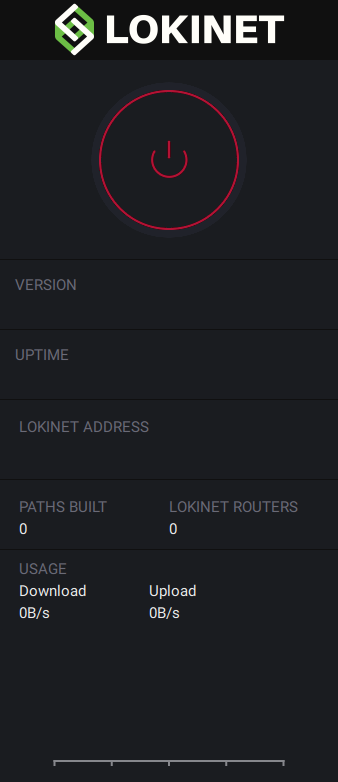

title: Sispop Documentation | Sispopnet Linux GUI Install Guide | Onion Routing
description: This guide walks you through the steps to get Sispopnet, a new onion router with sybil resistance properties, working on Linux.

# Sispopnet GUI install guide - Linux
Author: Jason (jagerman), Johnathan (SonOfOtis)

Source: [https://deb.sispop.site/](https://deb.sispop.site/)

To download Sispopnet Gui on Windows or Mac just head over to [sispopnet.sispop.site](https://sispopnet.sispop.site) or [sispop.site](https://sispop.site) and click the download button. 

## Initial Setup for Linux

### 1. Computer Preparation
We should update our package lists, the below command downloads the package lists from the repositories and "updates" them to get information on the newest versions of packages and their dependencies. It will do this for all repositories and PPAs.

Run the following command:

```
sudo apt-get update
```

You will notice a bunch of package lists were downloaded, once this is complete run the below command to fetch new versions of any packages we currently have installed on the system.

```
sudo apt-get upgrade
```

You will be prompted to authorise the use of disk space, type `y` and enter to authorise.

> Note: If you are prompted at any time that a version of any file is available then click the up and down arrows until you are hovering over install the package maintainer’s version and click enter.

If you do not have curl installed on your computer then let's install it as we will use it later:

```
sudo apt install curl
```

### 2. Installation

You only need to do this step the first time you want to set up the repository; when you've done it once, the repository will automatically update whenever you fetch new system updates.

To add the Sispop `apt` repository run the following commands:

The following command installed Jagermans public key used to sign the Binaries.

```
curl -s https://deb.sispop.site/public.gpg | sudo apt-key add -
```

The next command tells `apt` where to find the packages:

```
echo "deb https://deb.sispop.site $(lsb_release -sc) main" | sudo tee /etc/apt/sources.list.d/sispop.site.list
```

Then resync your package repositories with:

```
sudo apt update
```

Now install sispopnet:

```
sudo apt install sispopnet-gui
```

Congratulations, Sispopnet is now installed and running in the background. 

To access the GUI client all you need to do is open up the sispopnet-gui application.

## Turn Sispopnet off and on

Simply jump into the sispopnet-gui client and click the power button.




## Browse Sispopnet - Stay Private
Jump onto a browser and head over to the Sispopnet wiki SNApp:

- Sispopnet Wiki [http://dw68y1xhptqbhcm5s8aaaip6dbopykagig5q5u1za4c7pzxto77y.sispop/wiki/](http://dw68y1xhptqbhcm5s8aaaip6dbopykagig5q5u1za4c7pzxto77y.sispop/wiki/)

Congratulations, you're browsing Sispopnet.

---
## Troubleshooting

### Setting your DNS 

If you are having issues with resolving .sispop addresses then we need to edit your resolv.conf files and add your dns resolver.

#### Method 1

Run the following command:
```
apt install resolvconf
```

Then restart sispopnet:

```
systemctl restart sispopnet
```

#### Method 2
If Method 1 does not work we will need to add our nameserver manually.

Run the following command: 

```
sudo nano /etc/resolvconf/resolv.conf.d/head
```

Add the following at the bottom of this file:

```
nameserver 127.3.2.1
```

Once that line is added hold CTRL and click x. 
Click enter to confirm the file changes.

Next we need to update our /etc/resolv.conf file by running the command:

```
sudo resolvconf -u
```

Then restart sispopnet:

```
systemctl restart sispopnet
```

--- 

## Finish

Well done, you have finished the guide. Jump into the [Accessing SNApps guide](AccessingSNApps.md).


