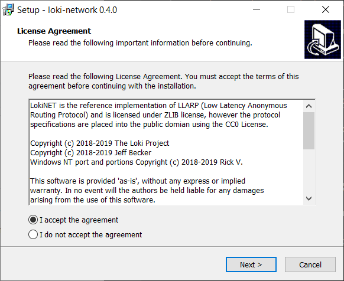
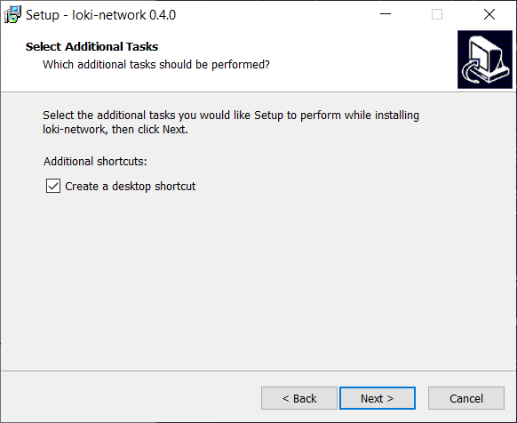
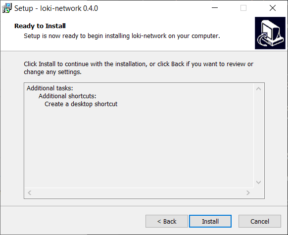
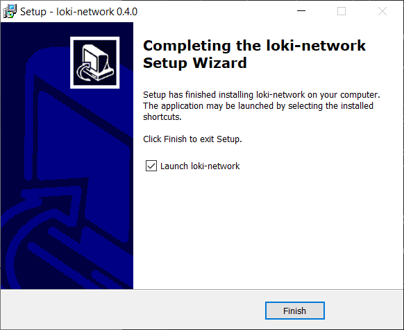
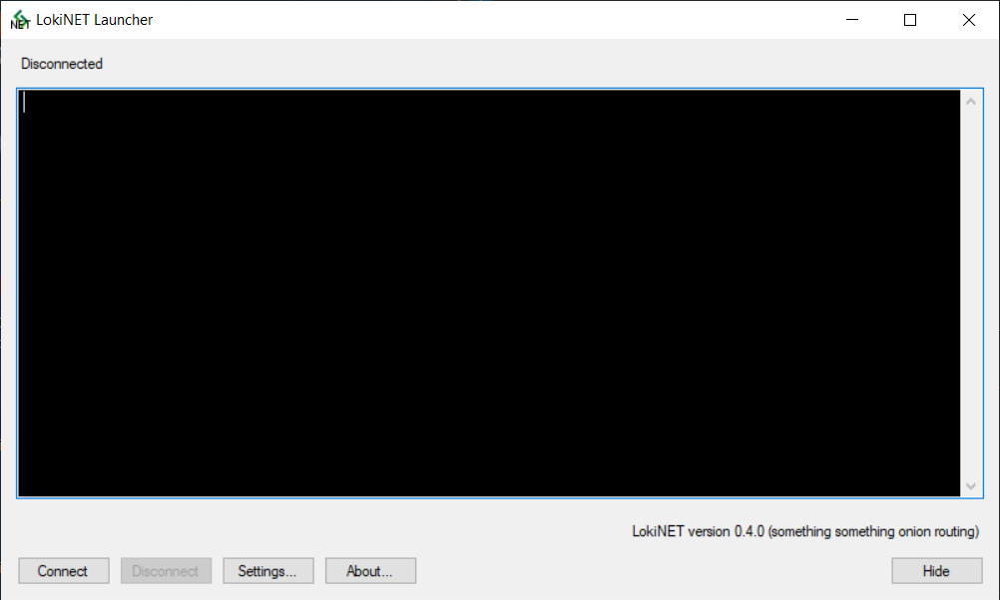
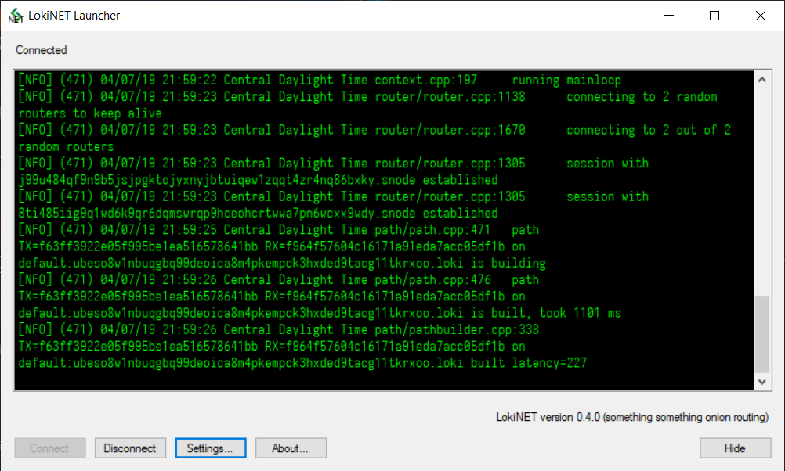

title: Sispop Documentation | Sispopnet Windows Install Guide | Onion Routing
description: This guide walks you through the steps to get Sispopnet, a new onion router with sybil resistance properties, working on Windows.

# Sispopnet install guide - Windows 10

## 1. Download the latest Sispopnet Windows Installer

Head to [sispopnet.sispop.site](https://sispopnet.sispop.site/), download the latest Windows Sispopnet. 

## 2. Run the installer

Run Sispopnet-win32.exe installer and allow permission as prompted. Please make note to set an exclusion or turn off Windows Defender/ Antivirus for this step.

## 3. Click install

After reading through the dialogue boxes, hit install.

## 4. Click 'Finish' and start the launcher 

## 5. Hit the 'connect' button on the SispopNet Launcher 

## 6. You're done!

You should now be connected. 

