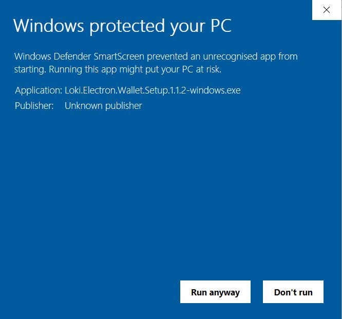
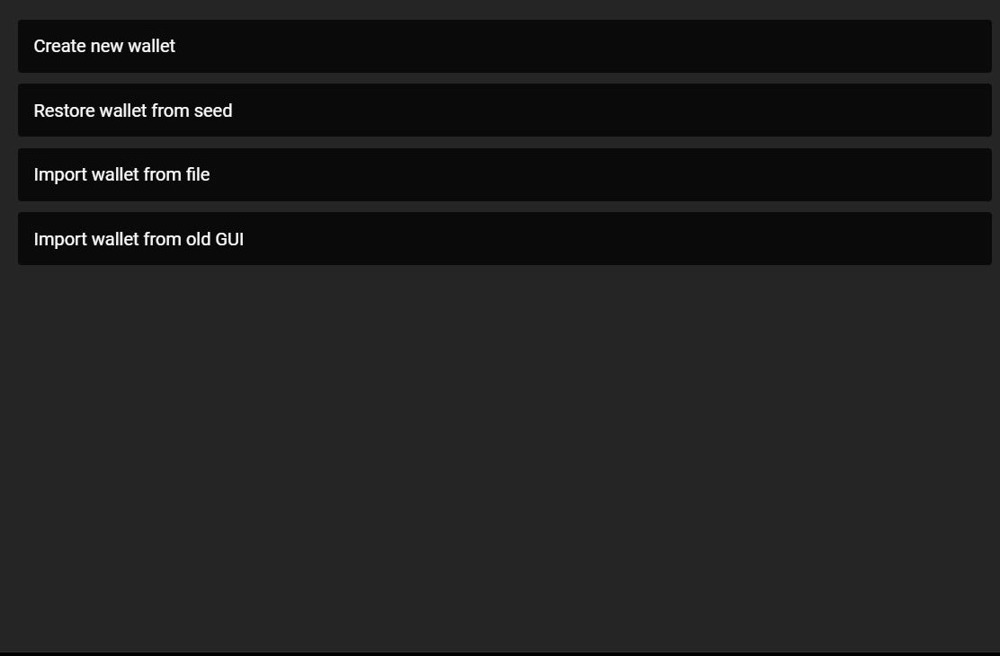
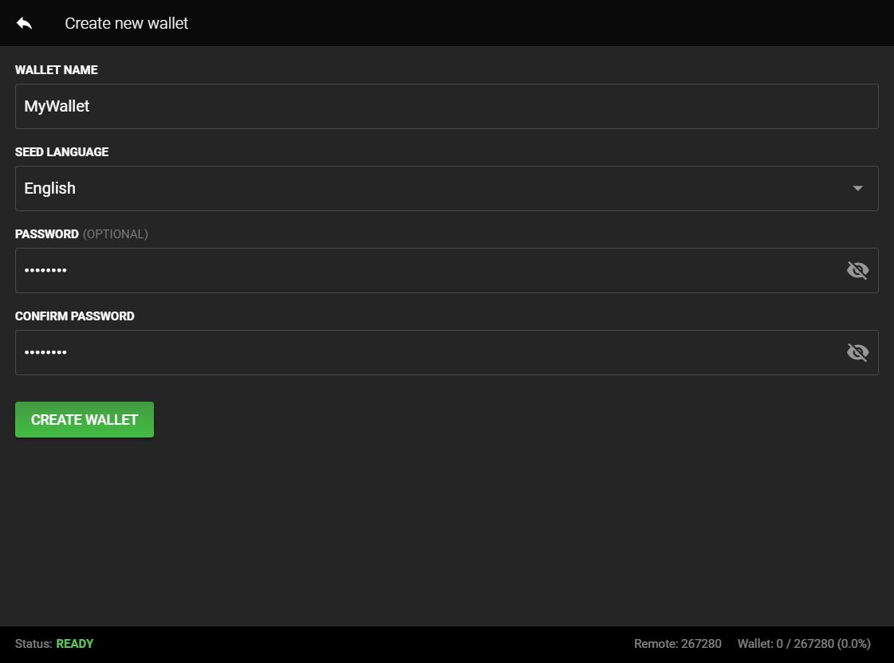
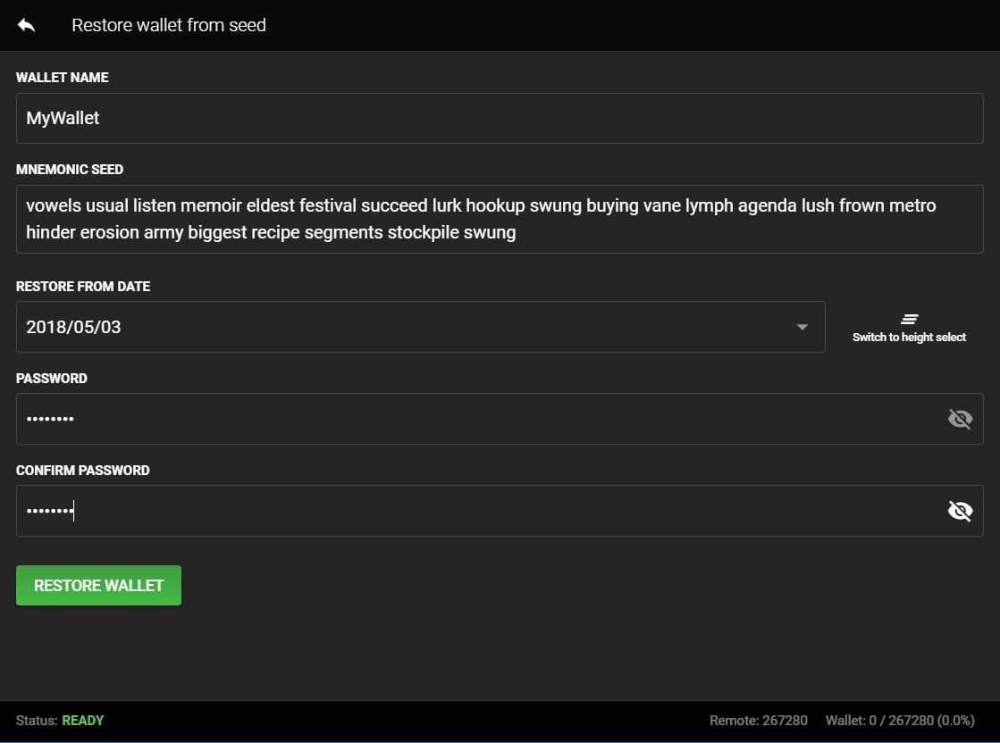

title: Sispop Documentation | Setup a Sispop Wallet on Desktop.
description: This document will tell you exactly how to set up and operate the Sispop GUI wallet. Step by step guide for Windows, Mac and Linux inside.

# Setup Guide on the Sispop GUI Wallet

This document will tell you exactly how to set up and operate the Sispop GUI wallet.
The latest version of the wallet can be downloaded [here](https://github.com/sispop-dev/sispop-electron-gui-wallet/releases).

##**Windows** 
> **Mac and Linux users skip to [step 1](#1-running-the-wallet-for-the-first-time).**

### Install Electron wallet and allow Defender permissions.

Open the executable file we downloaded from the Sispop Github `Sispop.Electron.Wallet.Setup.X.X.X-windows.exe` to start installion.

When installing the wallet the Windows Defender SmartScreen will prevent you from opening it unless you give the file permission. 

Click `Run anyway` to give the executable permission.

Now run through the installion prompts and then click install.

Once the installation has finalised open the Sispop Wallet by clicking your "Windows" key or the start menu and searching for `sispop electron wallet`.

## 1: Running the Wallet for the first time.

Once the installation has finalised open the Sispop Wallet by clicking your "Windows" key or the start menu and searching for `sispop electron wallet`.

Once opened the wallet will need to be configured. 

### 1.1: Choose your language.

### 1.2: Configure your settings.

Default settings are fine to use. 

> This is not required but if you would like to run your own node and broadcast your own transactions check the `Local + Remote Daemon` or the `Local Daemon Only` option.

Click `Next` when ready.

## 2: Creating/importing Wallet.

Once your settings have been configured if you do not already have a wallet generated yet then your screen will look like the following:

### 2.1: Creating new Wallet.

To create a new wallet click the `Create new wallet` button.

Next fill in the input fields that are required. It is recommended that you should consider encrypting your key with an optional password. 

Once input boxes are filled in click `CREATE WALLET` button.

### 2.2: Importing Wallet from seed.

To import a wallet from seed click the `Restore wallet from seed` button.

Next fill in the following input fields:

- Wallet Name: `Enter a name for your wallet.`

- Mnemonic Seed: `Enter the seed phrase that was generated when intially creating your wallet.`

- Restore from Date: `Enter the date or blockheight in which you want to restore your wallet from.`

> It is quicker to restore from the date in which you generated the wallet.

- Password: `Enter an optional password.`

- Confirm Password: `Enter the same password to confirm spelling.`

Once input boxes are filled in click `RESTORE WALLET` button.

