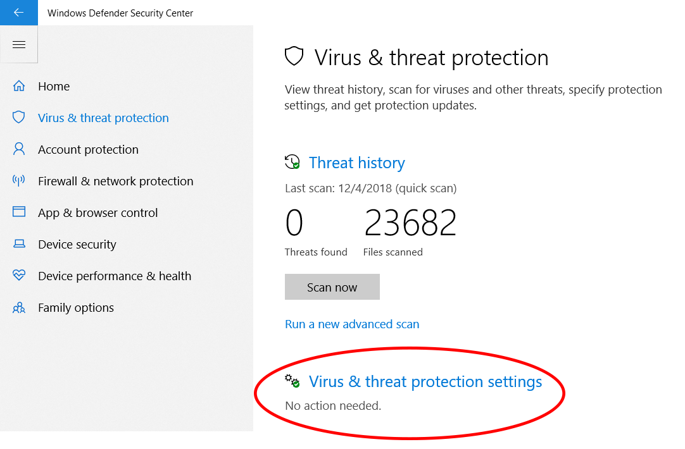
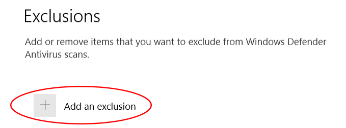
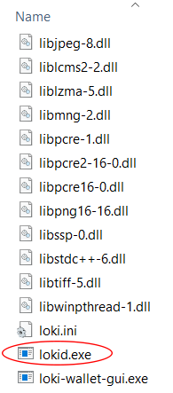
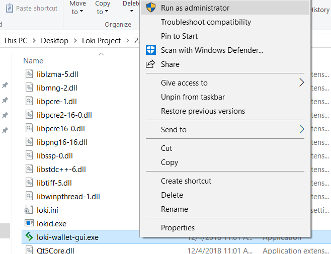
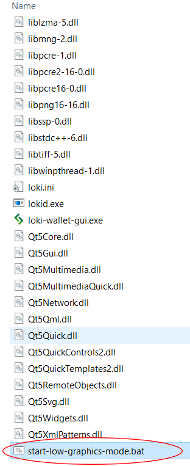
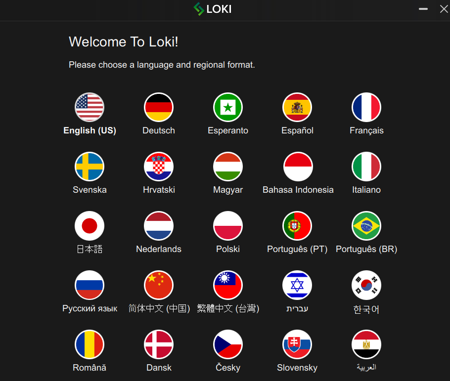
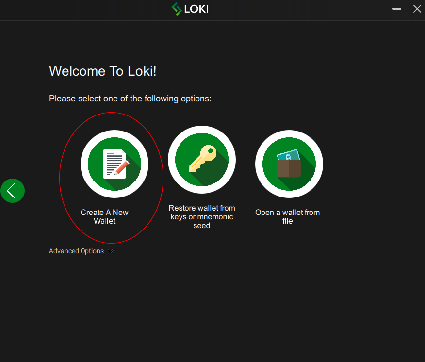
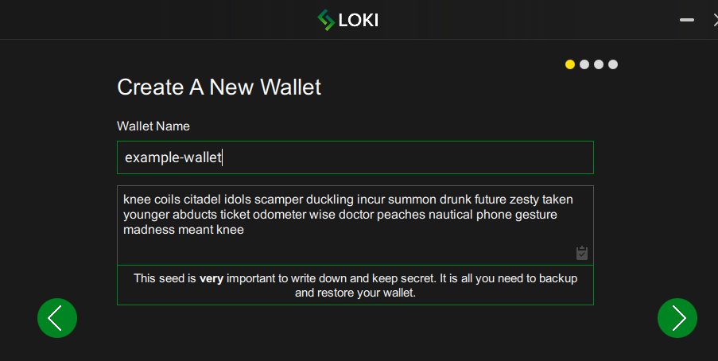
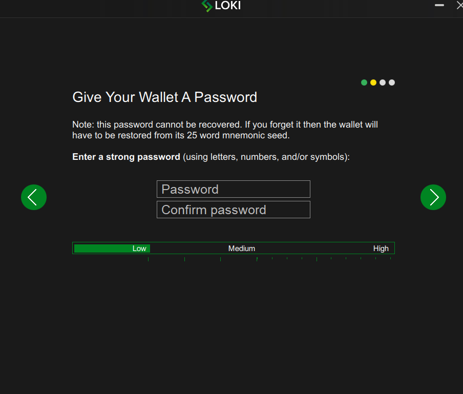
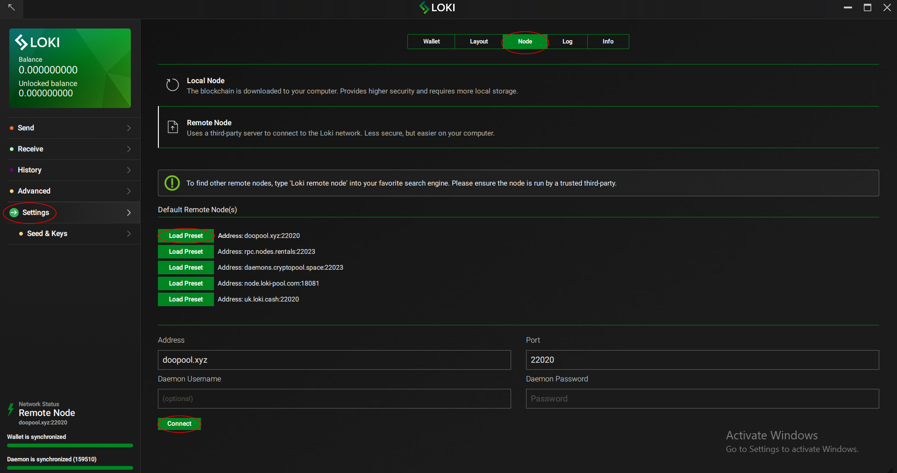

#Setup Guide on the Sispop GUI Wallet

This document will tell you exactly how to set up and operate the Sispop GUI wallet.
The latest version of the wallet can be downloaded [here](https://github.com/sispop-dev/sispop-gui/releases).

**Windows users:** (**Mac and Linux users skip to step 6**)

1) Make sure Windows Defender (or other anti-virus software) is not flagging it. Add 'sispop-gui-win...'  folder (or saved name of download) to exclusions in Windows Defender.

2) After exclusion is added, check if `sispopd.exe` is still in the folder. If it's not, unzip the archive file once again and put the files in the previously created folder.

3) Make sure that the path to your Sispop folder doesn't contain non-latin characters.  

4) Right click `sispop-wallet-gui.exe` and select 'run as administrator'.

  
5) If it crashes after the steps above are performed, run the file named `start-low-graphics-mode.bat` in the Sispop folder.

6) Select your language.

7) Select 'create a new wallet'.

8) **This step is important! Please be careful to write down and save your seed exactly as you see it on the screen and store it in a safe location.**

9) Enter a strong password.

10) If you have problems with syncing or connecting to the daemon, try to connect to a remote node (recommended):

Go to settings > go to node > select a remote node and click 'load preset' > scroll down and click 'connect'.

