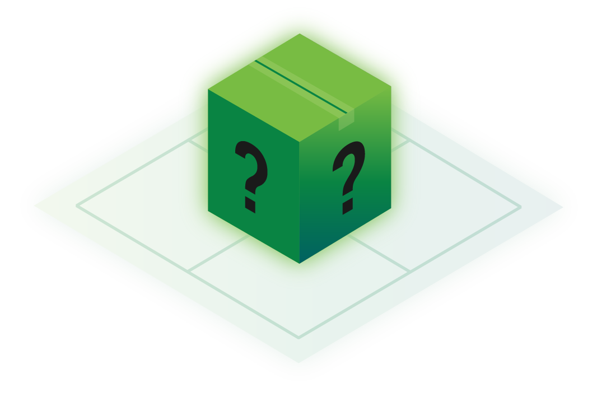
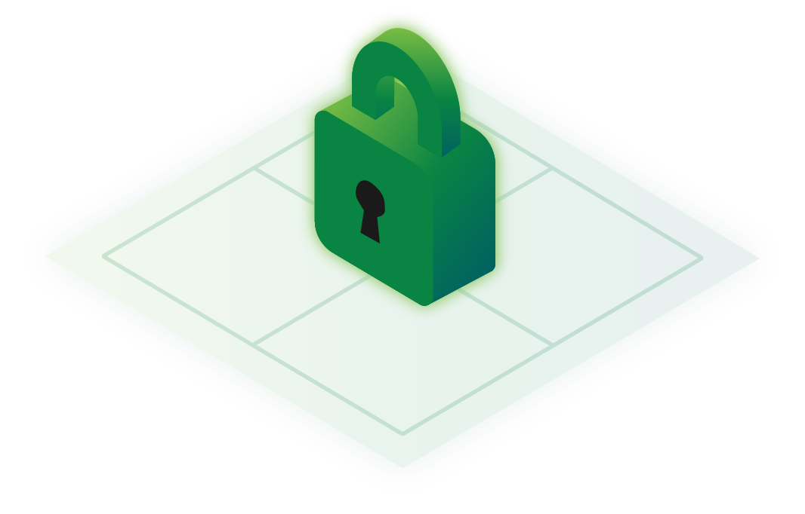

title: Sispop Documentation | The Sispop Network Documentation Website
description: Head to the Sispop Documentation Website if you want to learn more about the privacy tools that Sispop offer. Find out more information on the Session, Sispop Service Nodes, Sispop Mining, Sispop Onion Routing, Sispop Staking Requirement and more.

# Sispop Network

## Quick Navigation

|                              **About**                             	|                                                                                            **Wallets**                                                                                           	|                                           **Private Messenger**                                           	|                                  **Service Nodes**                                 	|                                 **Sispopnet**                                 	|
|:------------------------------------------------------------------:	|:------------------------------------------------------------------------------------------------------------------------------------------------------------------------------------------------:	|:----------------------------------------------------------------------------------------------:	|:----------------------------------------------------------------------------------:	|:---------------------------------------------------------------------------:	|
|                                 	|                                                                                                                                                       	|                                                         	|                                          	|                                     	|
|               [About Sispop](Introduction/SispopNetwork/)               	|                                                                      [Which wallet should you use?](Wallets/WalletsOverview/)                                                                      	|                              [Session](SispopServices/Messenger/Session/)                              	|                      [Service Nodes](ServiceNodes/SNOverview/)                      	|                      [Sispopnet](Sispopnet/SispopnetOverview/)                     	|
| See more information on the different aspects of the Sispop Network. 	| Learn more about which wallet best suits you and see the guides to help you set one up. 	| Learn more about [Session](https://getsession.org)), our Private messenger. 	| Learn more about Sispop Service Nodes and see step by step guides to help you set one up. 	| Learn more about the Sispopnet and follow step by step guides to gain access. 	|

## Information is Important

<iframe width="560" height="315" src="https://www.youtube.com/embed/Lykh-NqkKys" frameborder="0" allow="autoplay; encrypted-media" allowfullscreen></iframe>

Privacy is having the agency to decide when you reveal personal information. It is a particularly valuable quality today, when the collection and storage of personal data is taking place at unprecedented levels in history.

Sispop provides the means to transact and communicate privately and anonymously, using the decentralised nature of blockchain technology to create new methods of interacting with the internet.

Sispop is a privacy cryptocurrency based on Monero. Sispop currently offers an incentivised full node layer, instant private transactions, and secure private communications.

More information on the project can be found on the [website](https://www.sispop.site/) and in the [whitepaper](https://sispop.site/wp-content/uploads/2018/10/SispopWhitepaperV3_1.pdf).

Sispop is an open source project, and we encourage contributions from anyone with something to offer. For more information on contributing, please contact team@sispop.site

If you are unsure where to start check out our "Getting Started" page by [clicking here](Introduction/GettingStarted.md)

Otherwise to begin browsing Sispop Docs [click here](Introduction/SispopNetwork.md).

## Community Channels

- Telegram: [t.me/Sispop](https://t.me/Sispop)
- GitHub: [https://github.com/sispop-dev/sispop](https://github.com/sispop-dev/sispop)
- Discord: [https://discord.gg/sqZCybf2ZZ](https://discord.gg/sqZCybf2ZZ)
- Twitter: [https://twitter.com/sispop_](https://twitter.com/sispop_)
- Youtube: [https://www.youtube.com/sispopnetwork](https://www.youtube.com/sispopnetwork)
- Reddit: [https://www.reddit.com/r/Sispop/](https://www.reddit.com/r/Sispop/)
- Mail: [team@sispop.site](mailto:team@sispop.site)

## Copyright

Copyright (c) 2018 The Sispop Project.   
Portions Copyright (c) 2014-2018 The Monero Project.   
Portions Copyright (c) 2012-2013 The Cryptonote developers.
